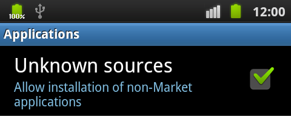
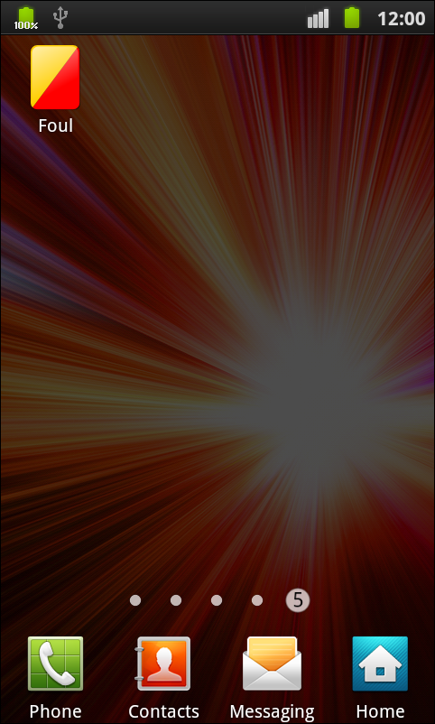
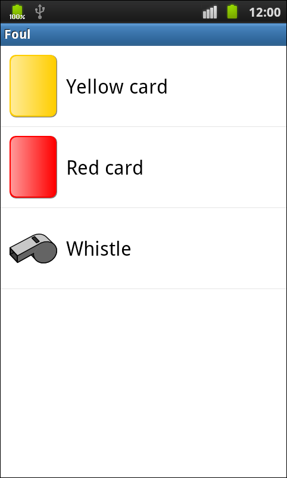
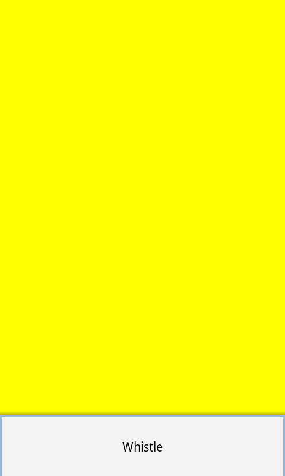
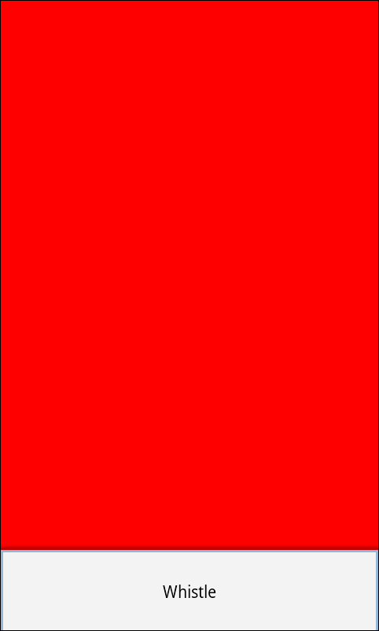
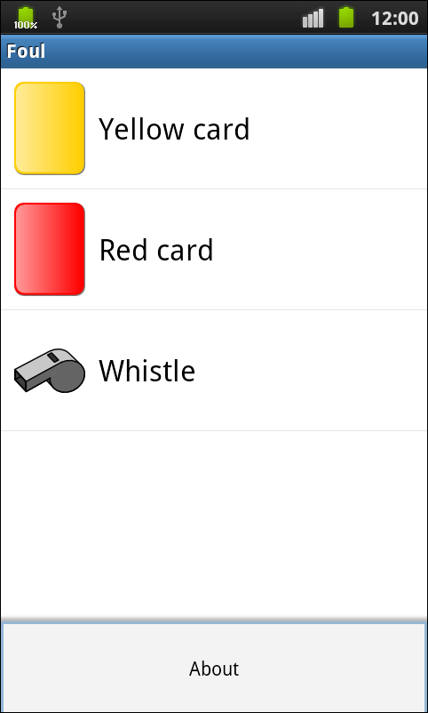
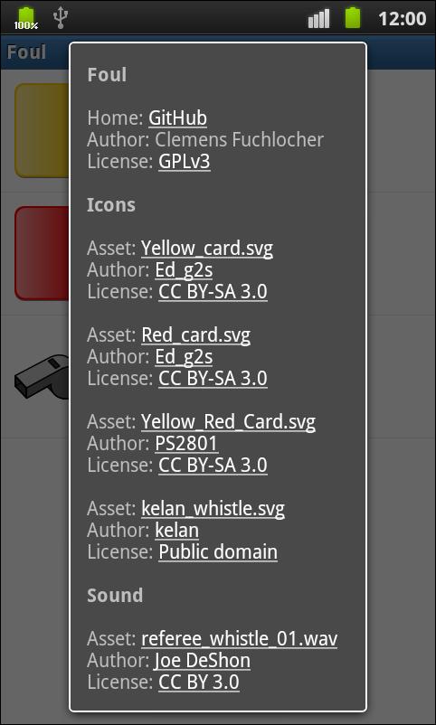

# Foul

Foul is a team building app for Android.

You are a scrum master and your team ignores all the rules? Then this app will save your day. It will keep your sprints clean, your backlog small, your dailies short and your team focused. With the help of a magical whistle and some colored cards, this app will bring your tasks back on track. And in the end, it will improve the overall performance of your team.

## Installation

1. First, you must allow the installation of non-Market applications as described in [User Opt-In for Apps from Unknown Sources](https://developer.android.com/distribute/open.html#unknown-sources):

2. After that, you can download and install the [foul.apk archive](http://www.vakuumverpackt.de/foul/foul.apk) directly through the previous link or by using the following QR code:

## Building with Maven

Please see [documentation/maven.md](documentation/maven.md) if you want to build this app on you own.

## Screenshots

## Credits

### Icons

Asset: [Yellow_card.svg](https://commons.wikimedia.org/wiki/File:Yellow_card.svg)  
Author: [Ed_g2s](https://commons.wikimedia.org/wiki/User:Ed_g2s)  
License: [CC BY-SA 3.0](https://creativecommons.org/licenses/by-sa/3.0/)  

Asset: [Red_card.svg](https://commons.wikimedia.org/wiki/File:Red_card.svg)  
Author: [Ed_g2s](https://commons.wikimedia.org/wiki/User:Ed_g2s)  
License: [CC BY-SA 3.0](https://creativecommons.org/licenses/by-sa/3.0/)  

Asset: [Yellow_Red_Card.svg](https://commons.wikimedia.org/wiki/File:Yellow_Red_Card.svg)  
Author: [PS2801](https://commons.wikimedia.org/wiki/User:PS2801)  
License: [CC BY-SA 3.0](https://creativecommons.org/licenses/by-sa/3.0/)  

Asset: [kelan_whistle.svg](https://openclipart.org/detail/5370/whistle-by-kelan)  
Author: [kelan](https://openclipart.org/user-detail/kelan)  
License: [Public domain](https://en.wikipedia.org/wiki/Public_domain)  

### Sound

Asset: [referee_whistle_01.wav](http://www.freesound.org/people/joedeshon/sounds/78508/)  
Author: [Joe DeShon](http://www.joedeshon.com/)  
License: [CC BY 3.0](https://creativecommons.org/licenses/by/3.0/)  

## License

Copyright (c) 2013 Clemens Fuchslocher, released under the GPLv3.
